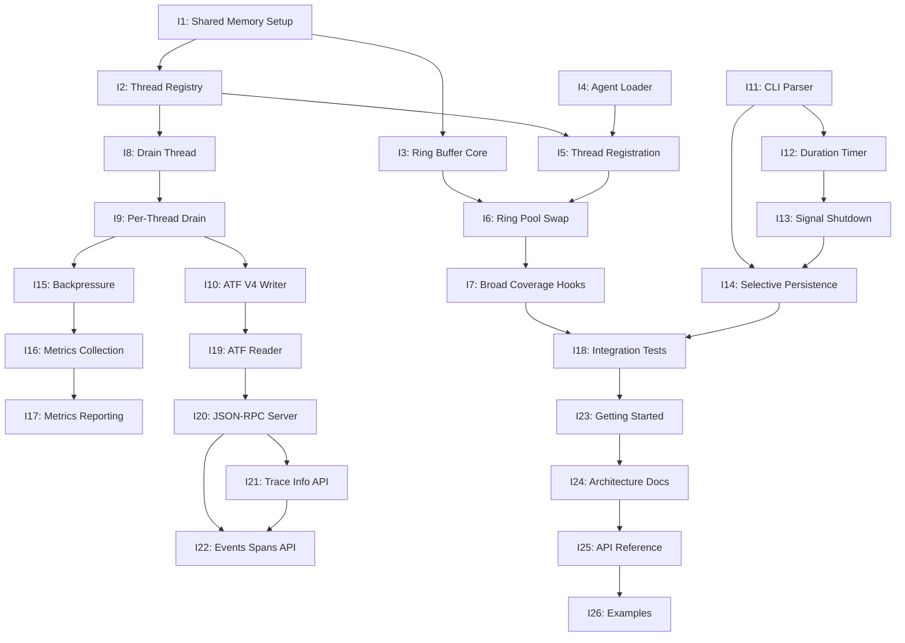

# M1 Native Agent MVP - 26 Iteration Breakdown (MVP Aligned)

## Overview
Breaking down the original 10 iterations into 26 fine-grained iterations (2-4 days each) to ensure proper implementation of the per-thread ring buffer architecture and MVP requirements including ATF V4 compliance, selective persistence, and Query Engine.

## Critical Architecture Fix
The original M1 plan missed the **per-thread ring buffer** design, implementing a shared ring buffer instead. This would have caused:
- Contention between threads
- Cache line bouncing
- Inability to scale linearly
- Violation of SPSC (Single Producer Single Consumer) semantics

## MVP Alignment Changes
Key changes to align with MVP requirements:
- **ATF V4 Format**: Replaced custom binary format with Protobuf V4
- **Selective Persistence**: Added marked event detection and dump-on-full-AND-marked logic
- **Query Engine**: Replaced Analysis Tools with JSON-RPC Query Engine
- **DSO Coverage**: Enhanced hooks to include dynamic libraries with excludes

## Iteration Dependency Graph

## Epic 1: Native Agent Injection (7 iterations)

### M1_E1_I1: Shared Memory Setup (2 days)
- **Goal**: Create shared memory segments
- **Deliverables**: 
  - Control block structure
  - Three SHM segments (control, registry, rings)
  - Unique naming with pid/session
- **Success**: Agent can attach to segments

### M1_E1_I2: Thread Registry (3 days)
- **Goal**: Per-thread lane architecture
- **Deliverables**:
  - ThreadRegistry with 64 slots
  - ThreadLaneSet structure
  - SPSC queue implementation
- **Success**: True thread isolation

### M1_E1_I3: Ring Buffer Core (2 days)
- **Goal**: Lock-free SPSC ring buffer
- **Deliverables**:
  - Ring buffer data structure
  - Atomic read/write operations
  - Wraparound handling
- **Success**: TSan clean, 10M ops/sec

### M1_E1_I4: Agent Loader (2 days)
- **Goal**: Frida agent injection
- **Deliverables**:
  - QuickJS loader script
  - Agent compilation
  - Process injection
- **Success**: Agent runs in target

### M1_E1_I5: Thread Registration (2 days)
- **Goal**: Thread-local lane access
- **Deliverables**:
  - TLS for lane pointer
  - First-event registration
  - Atomic slot allocation
- **Success**: Each thread gets unique lanes

### M1_E1_I6: Ring Pool Swap (3 days)
- **Goal**: Per-thread ring management
- **Deliverables**:
  - Ring swap protocol
  - Submit/free queue ops
  - Pool exhaustion handling
- **Success**: No data loss under pressure

### M1_E1_I7: Broad Coverage Hooks (3 days)
- **Goal**: Comprehensive function instrumentation with DSO support
- **Deliverables**:
  - Main binary hook installation
  - DSO on-arrival hooking (dlopen/dlclose interceptors)
  - Default exclude list (objc_msgSend, malloc, etc.)
  - CLI --exclude flag support
- **Success**: Full coverage with < 10% overhead

## Epic 2: Index Pipeline (7 iterations)

### M1_E2_I1: Drain Thread (2 days)
- **Goal**: Basic drain loop
- **Deliverables**:
  - Drain thread creation
  - Main loop structure
  - Shutdown handling
- **Success**: Thread runs continuously

### M1_E2_I2: Per-Thread Drain (3 days)
- **Goal**: Iterate all thread lanes
- **Deliverables**:
  - Thread iteration logic
  - Lane draining
  - Fair scheduling
- **Success**: All threads drained

### M1_E2_I3: ATF V4 Writer (2 days)
- **Goal**: Write events in ATF V4 Protobuf format
- **Deliverables**:
  - Protobuf Event serialization
  - Length-delimited stream writer
  - trace.json manifest creation
- **Success**: Schema-compliant ATF output

### M1_E2_I4: CLI Parser (2 days)
- **Goal**: Enhanced command-line interface
- **Deliverables**:
  - Basic argument parsing
  - Selective persistence flags (--pre-roll-sec, --post-roll-sec, --trigger)
  - Exclude flags (--exclude module[,module...])
  - Stack configuration (--stack-bytes)
- **Success**: User-friendly CLI with advanced options

### M1_E2_I5: Duration Timer (2 days)
- **Goal**: Timed execution
- **Deliverables**:
  - Timer thread
  - Duration tracking
  - Auto-shutdown
- **Success**: Accurate timing

### M1_E2_I6: Signal Shutdown (3 days)
- **Goal**: Clean termination
- **Deliverables**:
  - Signal handlers
  - Flush all threads
  - Resource cleanup
- **Success**: No data loss

### M1_E2_I7: Selective Persistence (3 days)
- **Goal**: Implement marked event detection and selective dump
- **Deliverables**:
  - Marking policy from triggers
  - marked_event_seen flag tracking
  - Dump-on-full-AND-marked logic
  - Window boundary management
- **Success**: Only marked segments persisted

## Epic 3: Hardening (4 iterations)

### M1_E3_I1: Backpressure (3 days)
- **Goal**: Handle overload
- **Deliverables**:
  - Pool exhaustion detection
  - Drop-oldest policy
  - Per-thread isolation
- **Success**: Graceful degradation

### M1_E3_I2: Metrics Collection (2 days)
- **Goal**: Performance tracking
- **Deliverables**:
  - Per-thread counters
  - Event statistics
  - Drop accounting
- **Success**: Accurate metrics

### M1_E3_I3: Metrics Reporting (2 days)
- **Goal**: Visibility
- **Deliverables**:
  - Periodic output
  - Formatted display
  - Rate calculation
- **Success**: Clear status

### M1_E3_I4: Integration Validation (3 days)
- **Goal**: End-to-end testing
- **Deliverables**:
  - Test fixtures
  - Validation suite
  - Performance benchmarks
- **Success**: All tests pass

## Epic 4: Query Engine (4 iterations)

### M1_E4_I1: ATF Reader (2 days)
- **Goal**: Parse ATF V4 format
- **Deliverables**:
  - Protobuf Event stream parser
  - trace.json manifest loader
  - Memory-mapped file access
  - Event iterator pattern
- **Success**: Efficient ATF traversal

### M1_E4_I2: JSON-RPC Server (3 days)
- **Goal**: HTTP server with JSON-RPC 2.0
- **Deliverables**:
  - HTTP server infrastructure
  - JSON-RPC 2.0 protocol handler
  - Request router and dispatcher
  - Error handling per spec
- **Success**: Compliant JSON-RPC server

### M1_E4_I3: Trace Info API (2 days)
- **Goal**: Implement trace.info endpoint
- **Deliverables**:
  - Metadata extraction (os, arch, times, counts)
  - Response caching
  - Fast manifest parsing
- **Success**: < 10ms response time

### M1_E4_I4: Events Spans API (3 days)
- **Goal**: Query endpoints
- **Deliverables**:
  - events.get with projection
  - spans.list with ENTRY/RETURN matching
  - Filters (function, module, time)
  - Pagination support
- **Success**: < 100ms for common queries

## Epic 5: Documentation (4 iterations)

### M1_E5_I1: Getting Started (2 days)
- **Goal**: Quick start guide
- **Deliverables**:
  - Prerequisites
  - Build steps
  - First trace
- **Success**: New user success

### M1_E5_I2: Architecture Docs (2 days)
- **Goal**: Technical documentation
- **Deliverables**:
  - System overview
  - Component details
  - Design rationale
- **Success**: Clear understanding

### M1_E5_I3: API Reference (2 days)
- **Goal**: Interface specification
- **Deliverables**:
  - CLI documentation
  - File formats
  - Error codes
- **Success**: Complete reference

### M1_E5_I4: Examples (2 days)
- **Goal**: Learning materials
- **Deliverables**:
  - ATF format examples
  - Query Engine usage
  - Selective persistence scenarios
  - Troubleshooting guide
- **Success**: Self-service learning

## Systematic Tech Design Template

Each iteration follows this structure:

1. **Objective** - Clear goal statement
2. **Architecture Diagram** - Visual system overview (Mermaid)
3. **Data Structures** - Key types and layouts
4. **Sequence Diagram** - Operation flow (Mermaid)
5. **State Machine** - State transitions (Mermaid)
6. **Implementation Details** - Code examples
7. **Memory Ordering** - Synchronization requirements
8. **Testing Strategy** - Unit/Integration/Performance
9. **Success Criteria** - Measurable outcomes
10. **Dependencies** - Required iterations
11. **References** - Related documentation

## Benefits of Fine-Grained Iterations

1. **Clearer Scope** - Each iteration has a single focus
2. **Better Testing** - Smaller units easier to validate
3. **Reduced Risk** - Problems caught early
4. **Parallel Work** - Some iterations can proceed simultaneously
5. **Progress Visibility** - More frequent deliverables
6. **Architecture Alignment** - Ensures per-thread design is implemented correctly

## Timeline Estimate

- **Epic 1**: 17 days (7 iterations, I7 extended to 3 days)
- **Epic 2**: 17 days (7 iterations, added I7)
- **Epic 3**: 10 days (4 iterations)
- **Epic 4**: 10 days (4 iterations, adjusted for QE)
- **Epic 5**: 8 days (4 iterations)

**Total**: ~62 days with sequential execution
**Optimized**: ~40-45 days with some parallel work

## MVP Alignment Summary

The updated M1 plan now includes:
- **ATF V4 Compliance**: Protobuf-based event format (M1_E2_I3)
- **Selective Persistence**: Marked event detection and windowed dumps (M1_E2_I7)
- **Query Engine**: JSON-RPC server with trace analysis APIs (M1_E4)
- **DSO Coverage**: Comprehensive hooking with exclude lists (M1_E1_I7)

Total iterations increased from 25 to 26 to accommodate MVP requirements.

## Next Steps

1. Implementation can begin with E1 iterations (foundation)
2. E2 and E4 can proceed in parallel after E1 completion
3. E3 hardening validates the complete system
4. E5 documentation can be developed alongside implementation