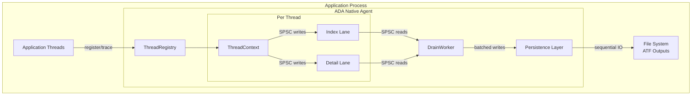
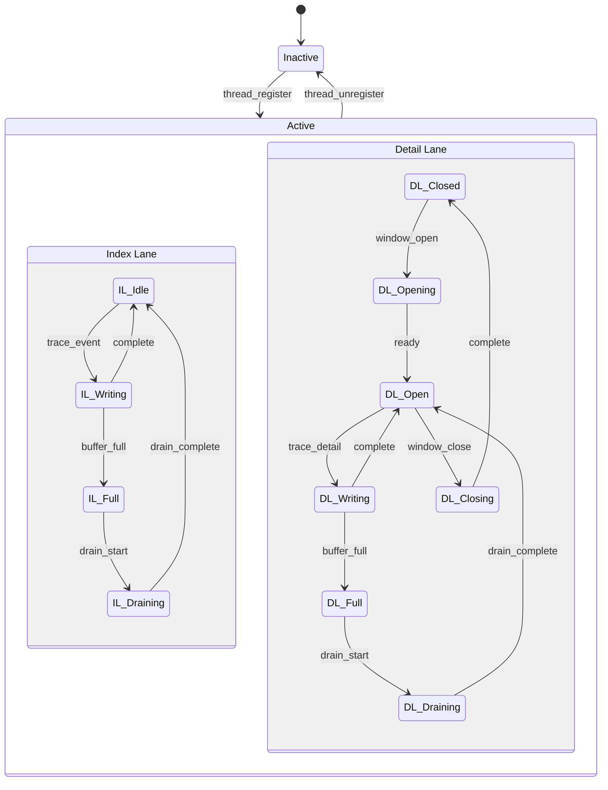
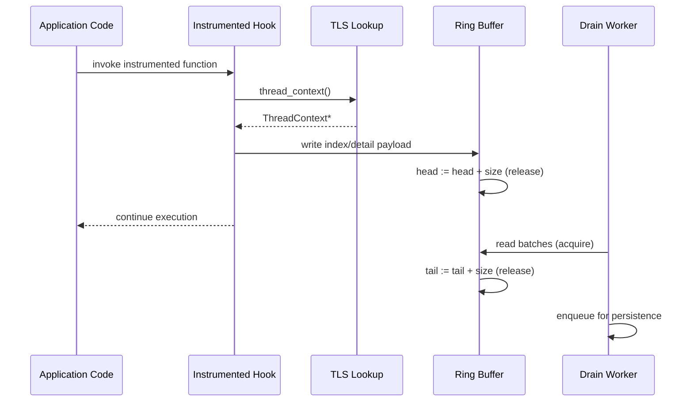
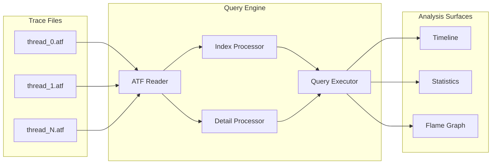

# ADA Native Agent Architecture Reference (M1_E5_I2)

## Scope
This document captures the enduring architectural shape of the ADA native tracing agent as delivered in milestone M1, epic E5, iteration I2. It extracts the stable structures, responsibilities, and integration points that underpin the agent so future work can reason about the system without consulting iteration planning artifacts.

## Runtime Topology
The agent occupies a defined space inside the traced process. Each application thread acquires thread-local tracing resources that feed a shared drain worker, which persists trace data to ATF files.

## Component Responsibilities
- **ThreadRegistry**: lock-free allocator for thread contexts, maintains lifecycle, aggregate statistics, and agent state.
- **ThreadContext**: thread-local binding that owns two ring buffers (index/detail) plus counters; aligned to avoid false sharing.
- **Index Lane**: fixed-width ring buffer (64 KiB) capturing always-on event skeletons for correlation.
- **Detail Lane**: larger ring buffer (1 MiB) activated in diagnostic windows to record extended payloads.
- **Drain Worker**: single consumer that drains both lanes with SPSC guarantees, batches IO, and hands data to persistence.
- **Persistence Layer**: serializes drained batches into append-only ATF files, one per thread, preserving write ordering.

## Thread Execution Model

### Thread Lifecycle
1. `ada_thread_register` claims a slot from `ThreadRegistry` using an atomic bitmap and initializes the associated `ThreadContext`.
2. Thread-local storage caches the context pointer for zero-cost lookups on trace hot paths.
3. When a thread exits or tracing is disabled, `ada_thread_unregister` releases the slot, clears SPSC ownership, and updates statistics.

### Two-Lane Ring Buffer Model
Index and detail lanes are managed independently so the common-path metadata is never blocked by diagnostic payloads.

### Ring Buffer Characteristics
- Single-producer, single-consumer queues enforce clear ownership: producer advances `head`, drain worker alone advances `tail`.
- Buffer sizes are power-of-two with `mask` addressing to eliminate modulo operations.
- Producers verify SPSC invariants (thread identity checks) to guard against misuse when contexts migrate.

## Data Flow

### Event Capture Path

### Drain and Persistence Pipeline
1. Drain worker polls index and detail lanes for each active `ThreadContext`.
2. Batches are coalesced per thread to maintain event ordering.
3. Persistence layer serializes batches into ATF segments with sequential disk writes, favouring large flushes to minimise syscall overhead.

### Offline Consumption

## Concurrency and Memory Ordering
Correctness relies on precise atomic semantics for lane ownership and state transitions.

| Operation | Actor | Ordering | Purpose |
|-----------|-------|----------|---------|
| Load `tail` before writes | Producer | Acquire | Observe drained space before publishing new data |
| Buffer memcpy | Producer | Relaxed | Covered by release when updating `head` |
| Store `head` | Producer | Release | Publish payload to drain worker |
| Load `head` | Drain | Acquire | Ensure payload is visible to consumer |
| Buffer memcpy | Drain | Relaxed | Covered by acquire of `head` |
| Store `tail` | Drain | Release | Signal consumed space to producer |
| State transitions | Any | Seq_Cst | Establish global happens-before across lanes |

Compiler fences (`atomic_signal_fence(memory_order_release)`) guard against reordering of memory accesses around the release/acquire pairs in hot paths.

## Performance and Resource Targets
- Index lane write latency < 50 ns; detail lane < 100 ns (measured with `rdtsc`).
- Per-thread throughput goal: >10M events/s without dropping index events.
- Memory footprint bounded at ~2 MiB per active thread (context + lanes).
- False sharing eliminated by 64-byte alignment of hot fields and padding in `ThreadContext`.
- Drain latency < 1 ms under steady-state loads to avoid prolonged back-pressure.

## Platform Integration
- **macOS**: Agent validates signature compliance via Security framework (`SecCodeCheckValidity`) to satisfy SIP requirements before enabling tracing.
- **Linux**: Startup performs capability check (`CAP_SYS_PTRACE`) to confirm the process can attach hooks safely.
- Both platforms share the same core tracing pipeline but gate privileged operations behind platform-specific guards.

## Error Handling and Diagnostics
- **Fatal**: unrecoverable conditions (OOM, invalid configuration, signature failure) raise fatal errors that stop tracing immediately.
- **Recoverable**: transient operational faults (buffer full, drain timeout, file write retry) log diagnostics and continue, potentially dropping detail events first.
- **Transient**: resource pressure cases (temporary disk full, remote transport hiccups) trigger retry with backoff within the drain loop.
- Thread-local `ada_error_context_t` captures the most recent failure with file/function origin and formatted context string for debugging.

## Key Interfaces
- `ada_thread_register` / `ada_thread_unregister`: manage per-thread lifecycle and SPSC ownership.
- `ada_trace_index` / `ada_trace_detail`: write index and detail events; enforce hot-path invariants.
- `ada_detail_window_open` / `ada_detail_window_close`: control detail lane activation windows.
- `ada_drain_start` / `ada_drain_stop` / `ada_drain_flush`: orchestrate consumer lifecycle and back-pressure management.

These primitives are the stable touchpoints that other subsystems (hooking, persistence, analysis) rely on when integrating with the native agent.
